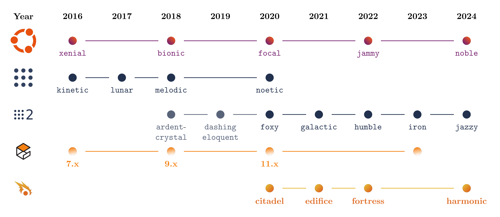

# ros_timeline

This project consists of a `.tex` file that generates a dependency graph for Ubuntu, Gazebo, and Ignition with the versions of ROS and ROS2.



## Background

The initial project was created by **IamPhytan** and available [here](https://gist.github.com/IamPhytan/fa76e3325d95688c63658a1ceee8c492), who established the relationships between Ubuntu versions and ROS/ROS2 versions. I have made modifications and additions to include the dependencies with Gazebo and Ignition.

## Features

- Visualization of compatible Ubuntu versions with ROS and ROS2.
- Addition of Gazebo and Ignition dependencies with respect to ROS/ROS2 and Ubuntu.

## Editing Tools

The graph, was edited with:

- An online LaTeX editor, Overleaf.

## Instructions

1. **Clone the repository**:
    ```bash
    git clone https://github.com/robotcopper/ros_timeline.git
    cd ros_timeline
    ```

2. **Compile the LaTeX file**:
    - Open the `ros_timeline.tex` file in your LaTeX editor.
    - Compile the file to generate the PDF.

3. **View the result**:
    - The generated PDF file will contain the dependency graph and can be viewed with any PDF reader.

## Project Structure

- `ros_timeline.tex`: The main file containing the LaTeX code to generate the graph.
- `assets`: The folder, providing all the illustrations.

## Acknowledgements

Thanks to **IamPhytan** for the initial work on the project.

## License

The modifications made on **IamPhytan** work are licensed under the [BSD 3-Clause License](LICENSE).

---