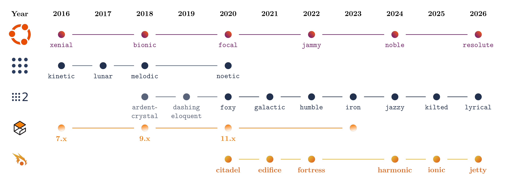
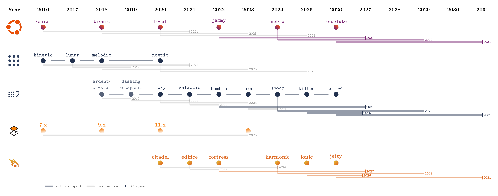

# ros_timeline

Timelines of Ubuntu, ROS / ROS 2, Gazebo Classic and Gazebo (Ignition) releases.

### Releases only

Source: [`ros-timeline.tex`](ros-timeline.tex)



### With support / EOL windows

Source: [`ros-timeline-eol.tex`](ros-timeline-eol.tex)



## Background

The initial project was created by [**IamPhytan**](https://github.com/IamPhytan), available [here](https://gist.github.com/IamPhytan/fa76e3325d95688c63658a1ceee8c492), who established the relationships between Ubuntu versions and ROS/ROS2 versions. I have made modifications and additions to include the dependencies with Gazebo and Ignition.

## Features

- Release timeline for Ubuntu, ROS 1, ROS 2, Gazebo Classic and Gazebo / Ignition
- Optional variant with support windows and EOL years (active vs past)

## Compile

Open either `.tex` file in Overleaf / a local LaTeX editor and compile with XeLaTeX, or:

```bash
xelatex ros-timeline.tex
xelatex ros-timeline-eol.tex
```

Then convert PDF → PNG if needed (`pdftoppm`, ImageMagick, etc.).

| Source | Output |
|--------|--------|
| `ros-timeline.tex` | releases only |
| `ros-timeline-eol.tex` | releases + support / EOL |

## Project Structure

- `ros-timeline.tex` — releases only
- `ros-timeline-eol.tex` — with support / EOL
- `assets/` — logos

## Acknowledgements

Thanks to **IamPhytan** for the initial work on the project.

## License

The modifications made to **IamPhytan**'s work are licensed under the [BSD 3-Clause License](LICENSE).
